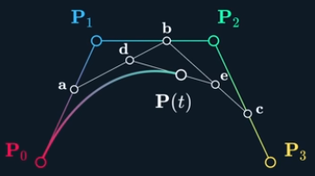
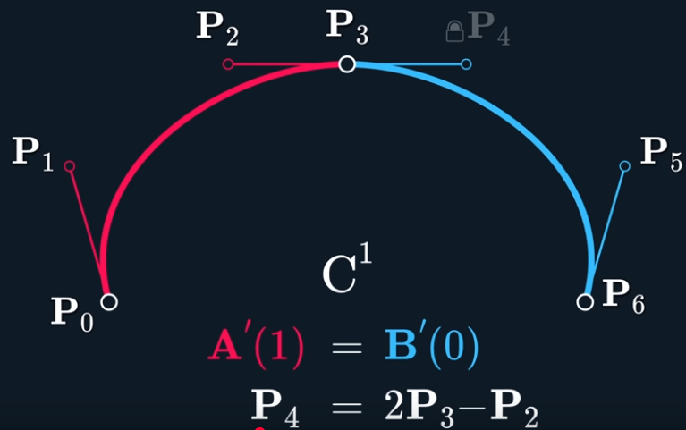

# The Continuity of Splines

* Link: https://www.youtube.com/watch?v=jvPPXbo87ds

---

The project aims to develop a map for a follow line robot group of Instituto Federal Catarinense - Campus Blumenau. So, I need to use splines to determine the curves of the path.

---

### Linear Interpolation - Lerp

Imagine to points $P_0$ and $P_1$ that are connected by a line. So, we can find any point between these two with $P(t)$ by the formula $P(t) = (1-t)P_0 + tP_1$.

By adding anothers two points, we can calculate a smoother curve by doing the Lerp with the other two points, like the image:

This method is expensive. There are other ways to do that, like Catmull-Rom, uniform, etc.

---

### Continuity

Lerp can't go to every point of the line, so we have to add some control points that will make sure the line will go through the joins.

We have that
$$
P(t) = [matrix 1x4][matrix 4x4][Points],
$$
then, deriving the $[matrix 1x4]$, we have the velocity, acceleration and then the joint. To make the velocity continuous (without jumps), we have to mirror the tangent points of the control points.

---

It will probably be enough until the minute 40 of the video. I'm going to implement something for that.